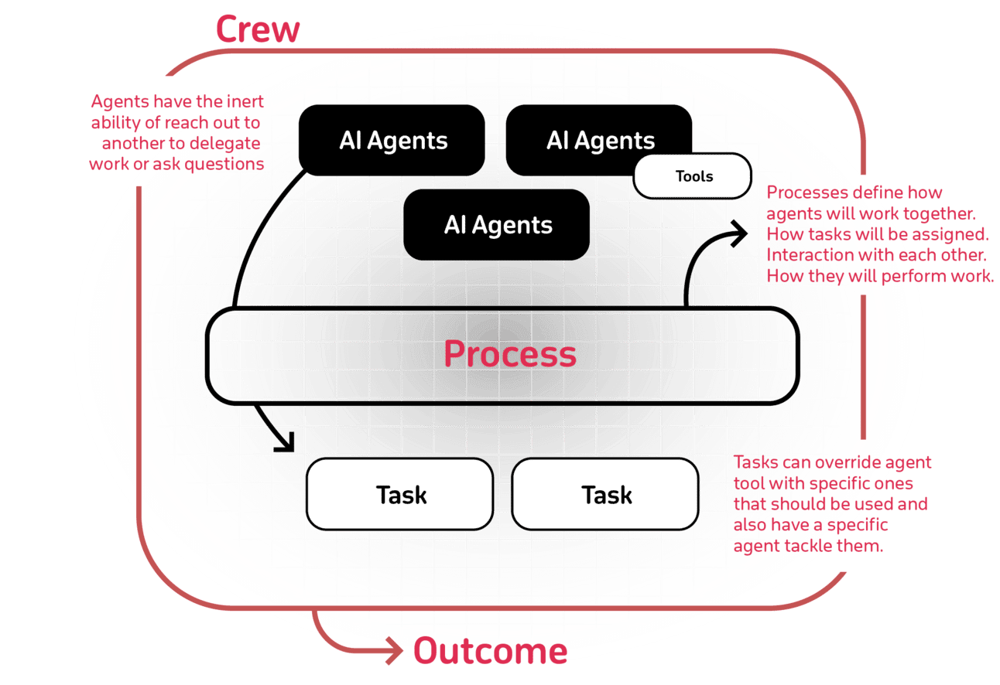

# Day 4: Tools and Frameworks for Building AI Agents

Today, we’ll shift our focus to the practical side: which tools and frameworks can help you build these agents with greater ease and efficiency? As AI technology advances, a growing ecosystem of developer tools and platforms has emerged. Instead of reinventing the wheel, you can leverage these resources to rapidly prototype, scale, and maintain AI Agents that fit your unique business goals.

## Ways to Consume AI Agents

Depending on your expertise, time constraints, and business needs, you have several options:

#### **1. Pre-Built Vertical Agents**

Specialized agents are already out there, tailored to common tasks like customer support, marketing automation, or supply chain management. These “off-the-shelf” solutions let you start leveraging AI Agents immediately, with minimal customization needed. It’s a great way to get quick wins without heavy development work.

A good example (not sponsored) is [https://www.11x.ai/](https://link.mail.beehiiv.com/ss/c/u001.co3r4Jdx_Ma_3EdOoVpYmiXFX1jTOI9KbzMEDwqxuAjxA5HB6vV9Oxc0NPbk8uAD3v4FurvMAVK4av_OhP7hn6ItUAHIkMr9iXL8FXL9k-DddY5gDy_3X3_C10GiSjKJf1UmrjPLv_YiL0zARCfrUu7lO_kFzwlIAra4GR4mjdkrnkIN79CDcUsnInqB4nLC/4cl/BD17_I--QfmWe8FLlhYmaQ/h14/h001.C99i2Drbb7dSFcYxCTrJmXrgA_Do8lblTuQzMFjIfjo), which provides Sales, RevOps, and Go-To-Market AI Agents that act as digital workers delivering human results.

#### **2. No-Code Tools**

No-code platforms allow you to build, configure, and deploy AI Agents using intuitive interfaces — dragging, dropping, and connecting components rather than writing code. These tools are perfect for non-technical users who still want to harness the power of AI Agents. It puts advanced capabilities in the hands of business analysts, product managers, and other stakeholders who may not have a coding background.

My favorite tool is [Langflow](https://link.mail.beehiiv.com/ss/c/u001.co3r4Jdx_Ma_3EdOoVpYmo-nDiwOrA8Sl7PZHbgNOPf1ElcTYj26hiXpEBC2p7gL9mLMPYrbx0hUWs_K_yMN-HOHt-xqAflLE9331d450TJqnRlNbyqjQxoHXkHEsjSppCa-Y_7V2hK5pQpfsvyOBg7zrUdED9-NKbVyYaCnwdsyaIA8OkXK949pqvZTZNjv7vH0_IwQYP2jeGU1XBuMFg/4cl/BD17_I--QfmWe8FLlhYmaQ/h15/h001.lDNPz3Wi-TJfV3-Y_VXoRriopdgfvD8gLKbvArrZrf4), a visual framework for building multi-agent and RAG applications. It is open-source, Python-powered, fully customizable, and is LLM and vector store agnostic.

#### **3. Developer Frameworks**

For teams that need full control and customization, developer frameworks offer granular access to every part of your agent. With these tools, your engineering team can integrate advanced models, create complex decision logic, and fine-tune performance. While this requires more effort and technical know-how, it also unlocks the deepest level of flexibility and scalability.

## Popular Tools & Frameworks for AI Agent Development

#### **CrewAI**

Cutting-edge framework for orchestrating role-playing, autonomous AI agents. [CrewAI ](https://link.mail.beehiiv.com/ss/c/u001.bZk3R2gdQ8b05uWnqBcbJBxnS5WldNwRrpshF7u2qX-vnxpWWL9ulR6AVrEEKpGTo8t3JdlvvGzrvx4_EZ8U_KuzqpTOOlaNSaPe68nSJC1byLjOc_8bmv-lLEbIICpdq7uMoBk-LMLaesgL8GZ7JCXnotTpqIqpEcIYj6w5x6zFrGujSV9zz8mUMPG_4VthlApfppxrjSr7Md5Mi6gEWg/4cl/BD17_I--QfmWe8FLlhYmaQ/h16/h001.JmiV9MTo9FmpPrF5IiHoyKSkf4xmapw4CgShlJxyfSY)empowers agents to work together seamlessly by fostering collaborative intelligence, tackling complex tasks. Open-source developer experience is available on GitHub, which has more than 20k stars and a new enterprise version.

A great way to start is the set of examples available in the repo: [https://github.com/crewAIInc/crewAI-examples](https://link.mail.beehiiv.com/ss/c/u001.bZk3R2gdQ8b05uWnqBcbJFrjyTNLBx7-LBjYBGmIlPwXOyGtC-UwkSF5n7dBUHGsHG9cwna73-iJdUND5rt41Vg0x_DWB0M5QrnCm9TEgqYTPu12V8J6qtJUPjOfogOC82FP1dr0nAzIHiAV40vrXQr3wwJPkimrYyW3EBQHyohw2kYlQ9K187jzrtPtb2E06b8M1Xn-zt2JaO_lGSDQsD9sP1jnaqNfIa1ECFZ8b8g/4cl/BD17_I--QfmWe8FLlhYmaQ/h17/h001.ngV95EMH-WbPJNsPLHZtrZuWARHtyAZgF6CqiRDaX0U)

#### **LangGraph**

[LangGraph ](https://link.mail.beehiiv.com/ss/c/u001.co3r4Jdx_Ma_3EdOoVpYmj9wcndntAIkWqF0EHViJ3rYxi4zBNAly-wT1Wole6fWMG8SXYskCLSMPgz60tKN-cwpklaq3wA6oqD9qipzSLldYQ5VbNrL4BNLZgW8La7Gs74w4ZnOBSyiajqSZ98Uwp8nC9MZQOhxki7KZmQVJ3v39XOHI5Cm9Madvn62kyiYFTMQLW-evNaqL2mowps3XQ/4cl/BD17_I--QfmWe8FLlhYmaQ/h18/h001.VYR-SqSiUjPkok_eWyEFQjahaLtGVqxd5zMHZFi5Qvc)provides a flexible framework for managing diverse control flows, including single-agent, multi-agent, hierarchical, and sequential setups, while reliably handling complex scenarios. It ensures agent reliability with built-in moderation and quality loops.

The LangGraph Platform allows users to templatize cognitive architectures, making tools, prompts, and models easily configurable with its Platform Assistants.

You can get started with the [Quick Start Guide](https://link.mail.beehiiv.com/ss/c/u001.I_5eI1fB5oFCd67sJbESkPdJSJZ5vEr6-TqW-mbIhNeaUP5zw-uCauD121_thU8ARpKvxPksDT14epnluAR5zk0AgY8fNPOh3ITBw3pqP4FkgtbW3N4Pi_rMyaOOSIYCxIMMLDkxFzZvjekW1gWiA5kUglVlvf-mgMO9FGdKGSGhHZrSEu9li6itYzb54TgGd2QiR6alLB4YCtfd01f1w7j55mXEO5AndY2i08uZuFlhfFZNkJCHuuj0B3DJAeZV/4cl/BD17_I--QfmWe8FLlhYmaQ/h19/h001.uNiJHfej0UE85MDJ-MwQFZrIZm5wFiuvfPEr6yLoCAY), complete of tutorials in Python.

#### **LlamaIndex**

[LlamaIndex ](https://link.mail.beehiiv.com/ss/c/u001.E-oKtoPUFbLVjYrGXFKgjHcsCXq5nvguBpKXSWMvwtGvmr-OY6e8uYjzjE8lsYzv3VXiXHmduZVUcFlLhYtV6cgXLBy3yuPUJE7eY9P7TuLv66zjPgsb77vAy73aCy8GlsPMIxKAf2DIZZ-4F4QCV66R33ml8pnviltinY2uHG0M81PrwqL9pjnT_qFxDu9OQz5irINutMsY4QIMULo0SHFEecyJeOXGpeihPSC08QRr0rC5-dzMdgMC82DdFECvDOApiWg2eTOP8fuFF4rwTQ/4cl/BD17_I--QfmWe8FLlhYmaQ/h20/h001.0LXfJWA9YTt8ppaMJxJHQ80ldEuuLySYn4VCpC5Y8Ck)is a framework for building context-augmented generative AI applications with LLMs, including agents and workflows. As part of it, you can build Agents for use cases such as Agentic RAG, Report Generation, Customer Support, or SQL Agents, among many others. They all come with samples Python & TypeScript to help you get started.

#### **Bee**

The [Bee Agent Framework](https://link.mail.beehiiv.com/ss/c/u001.bZk3R2gdQ8b05uWnqBcbJPX0i_NTnNT98uu4WBPcEvss676rbM89jqZy4EQAZfb_Q1VXRuA9oME8dmFmbn2LS3_517dmJw4uG35tqi18vfMSZL1zpKazAy-fR3N2-wg9Sl6HCJF7RI0jtRXI5fTfWV0Ut53U1JK35Joqr3vBHEoQg7e3Pt5XMjJKW4nl3kO98MQ3pEZFM4ZM81wOwrnh7vrbSzGxN29kzkfR3Q9_TYo/4cl/BD17_I--QfmWe8FLlhYmaQ/h21/h001.prrSR66XT_hOaStj1sVJ_PrMVWAN59Dv5IbmwcYzsck) from IBM makes it easy to build scalable agent-based workflows with your model of choice. The framework is designed to perform robustly with  Granite and Llama 3 models, and we're actively optimizing its performance with other popular LLMs.

* **Tools**: Use our **built-in tools** or **create your own** in Javascript/Python.
* **Code interpreter**: Run code safely in a **sandbox container**.
* **Memory**: Multiple **strategies** to optimize token spend.
* **Serialization** Handle complex agentic workflows and easily pause/resume them **without losing state**.
* **Instrumentation**: Use **Instrumentation** based on **Emitter** to have full visibility of your agent’s inner workings.
* **Production-level** control with **caching** and **error handling**.
* **API**: Integrate your agents using an OpenAI-compatible **Assistants API** and **Python SDK**.

#### **Chat UI**:

Serve your agent to users in a **delightful UI** with built-in transparency, explainability, and user controls.

These are just some of the frameworks I like. There is also AutoGen from Microsoft, which is very impressive. Choose the framework that best aligns with your team's skill level, business needs, and desired level of customization, with most frameworks eventually monetizing through premium features, enterprise support, and specialized modules.

### Choosing the Right Approach

When selecting tools, frameworks, and consumption models, consider:

* **Team Capabilities:** No-code solutions vs. engineer-centric frameworks.
* **Speed to Market:** Pre-built solutions vs. fully customized builds.
* **Scalability & Maintenance:** How easily will you update and grow your agent ecosystem?

By evaluating these factors, you can find the ideal path to quickly and effectively bring AI Agents into your operations—whether leveraging pre-built solutions for a rapid start or carefully crafting a custom agent ecosystem to meet complex, evolving business needs.
